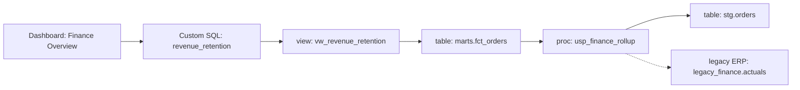

# Expected output — Tableau lineage (model answer)

This is what a good lineage package looks like for `sample-dashboard.twb`. Use it to verify your own output; exact wording will vary.

## 1. Dashboard data sources

| Connection | Type | References |
| --- | --- | --- |
| Revenue Retention (reporting_dw) | Custom SQL | `dbo.vw_revenue_retention` |

## 2. Custom SQL blocks

```sql
SELECT cohort_month, revenue, customers
FROM dbo.vw_revenue_retention
WHERE cohort_month >= DATEADD(MONTH, -12, CAST(GETDATE() AS date));
```

## 3. Referenced views / stored procedures

| Object | Type | Definition found? | Notes |
| --- | --- | --- | --- |
| `dbo.vw_revenue_retention` | view | yes | aggregates `marts.fct_orders` |
| `dbo.usp_finance_rollup` | proc | yes | builds `marts.fct_orders` |

## 4. Upstream tables / linked-server references

| Upstream object | Reached via | Confirmed? |
| --- | --- | --- |
| `marts.fct_orders` | `vw_revenue_retention` | confirmed |
| `stg.orders` | `usp_finance_rollup` | confirmed |
| `[LEGACYERP].legacy_finance.dbo.actuals` | `usp_finance_rollup` | inferred (linked server, external) |

## 5. Confirmed vs inferred lineage

- **Confirmed:** dashboard → custom SQL → `vw_revenue_retention` → `marts.fct_orders` → built by `usp_finance_rollup` → `stg.orders`.
- **Inferred:** `usp_finance_rollup` → `[LEGACYERP].legacy_finance.dbo.actuals` (definition not in workspace).

## 6. Unknowns requiring owner review

- What is the grain and refresh cadence of `legacy_finance.dbo.actuals`?
- Does the new ERP platform expose an equivalent actuals source, or does this dependency break on migration?
- Are `stg.orders` and the legacy actuals deduplicated, or can the same revenue appear twice via the `UNION ALL`?

## 7. Data-flow diagram



- Solid arrow = confirmed. Dotted arrow = inferred (open question).
