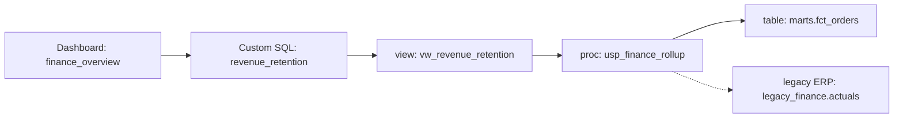

# Mermaid data-flow standard

A consistent diagram style makes lineage comparable across dashboards and safe to render in the app and in Markdown.

## Rules

1. Use `flowchart LR` (left-to-right) for data flow.
2. **Confirmed** edges are solid (`-->`). **Inferred** edges are dotted (`-.->`).
3. Node IDs are space-free (camelCase or underscores). Put the human label in quotes.
4. Prefix labels with the node type: `Dashboard:`, `Custom SQL:`, `view:`, `proc:`, `table:`, `legacy ERP:`.
5. No colors or `style`/`classDef` directives — let the renderer theme it (works in light and dark).
6. No `click` events. Avoid reserved IDs (`end`, `graph`, `subgraph`).
7. Public-safe labels only: no real server/database/table/owner names.

## Canonical example

## Legend to include under each diagram

- Solid arrow = confirmed (definition read in the workspace).
- Dotted arrow = inferred (named but definition not present; an open question).
